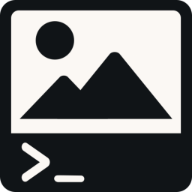

# -Good Project name-

<p align="center">
    
</p>

<p align="center">
    <em>An image editor. In the terminal. In the browser.</em>
</p>

## Project Structure

```text
project/
│   .gitignore
│   .pre-commit-config.yaml
│   build.py
│   CONTRIBUTING.md
│   LICENSE
│   pyproject.toml
│   README_template.md
│   README.md
│
├─ .github/workflows/
│    lint.yaml
│
├─ public/
│    index.html
│    templates/apptemplate.html
│
├─ samples/
│    Pipfile
│
├─ src/
│    hello.py
└─   main.py
```

## Setup

1. First we set up our python enviroment

```shell
python -m venv .venv
```

2. Entering it

```shell
# Linux, Bash
$ source .venv/bin/activate
# Linux, Fish
$ source .venv/bin/activate.fish
# Linux, Csh
$ source .venv/bin/activate.csh
# Linux, PowerShell Core
$ .venv/bin/Activate.ps1
# Windows, cmd.exe
> .venv\Scripts\activate.bat
# Windows, PowerShell
> .venv\Scripts\Activate.ps1
```

3. Installing development dependecies

```shell
pip install --group dev
```

_If it gives errors try:_

```shell
python -m pip install --upgrade pip  
```

4. If we want to exit our enviroment we do

```shell
deactivate
```

## Running the project

To build the project, run

```shell
python build.py --serve --port 8000
```

This will serve the project on `http://localhost:8000` after building it to `build/`. If you make changes to your code, run `build.py` again to rebuild the project.

## Contributors

[](https://github.com/Miras3210/codejam-laudatory-larkspurs/graphs/contributors)
